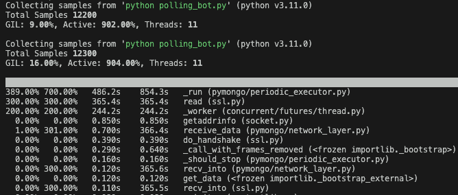
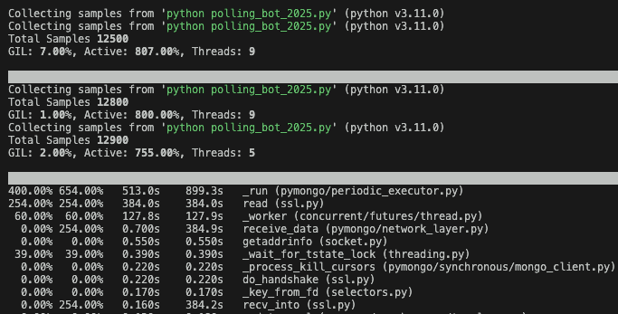

# Telegram Polling Bot Framework

A robust Python framework for creating automated Telegram bots that schedule polls, manage messages, and collect user votes in MongoDB.

## Features

- 📊 **Automated Polling** - Schedule and post polls with customizable duration and options
- ⏰ **Smart Reminders** - Send reminders before poll expiration  
- 📸 **Image Support** - Optional image sending with polls
- 🗑️ **Message Management** - Automated message cleanup and deletion
- 🗳️ **Vote Collection** - Store votes and poll results in MongoDB
- ⚡ **High Performance** - Unified async architecture for low-latency operations
- 🌐 **Multi-language** - Unicode support for international users
- 🔧 **Configurable** - Flexible poll options and settings

## Prerequisites
- Python 3.x
- Telegram account
- pip package manager
- MongoDB or SQL database

## Database Schema

### polls Collection
```javascript
{
  "_id": "6323309508986667494",           // Poll ID from Telegram
  "message_ids": [45, 46],               // Tracked message IDs for cleanup
  "poll_creation_date": "2025-05-22",    // ISO date string
  "poll_message_id": 44,                 // Main poll message ID
  "total_votes": 2,                      // Total vote count
  "option_votes": [                      // Vote breakdown by option
    {
      "option_text": "Option A",
      "votes": 1,
      "percentage": 50
    },
    {
      "option_text": "Option B", 
      "votes": 0,
      "percentage": 0
    },
    {
      "option_text": "Option C", 
      "votes": 1,
      "percentage": 50
    }
  ],
  "status": "closed",                    // active, closed, cancelled
  "poll_question": "Daily Poll - 2025-05-22 22:35",
  "poll_options": ["Option A", "Option B", "Option C"]
}
```

### votes Collection
```javascript
{
  "_id": "6123456783-6323309508986667494", // user_id-poll_id composite key
  "user_id": 6123456783,                   // Telegram user ID
  "selected_option": 0,                    // Selected option index
  "poll_id": "6323309508986667494",        // Reference to poll
  "poll_creation_date": "2025-05-22",      // Poll date for indexing
  "vote_timestamp": "2025-05-22T22:35:46.381Z", // Vote time
  "username": "userabc"                    // Telegram username
}
```

## Quick Start

### 1. Clone the Repository
```bash
git clone https://github.com/yourusername/telegram-polling-bot.git
cd telegram-polling-bot
```

### 2. Install Dependencies
```bash
pip install -r requirements.txt
```

### 3. Create Telegram Bot
#### Get Bot Token from BotFather
1. Message [@BotFather](https://t.me/botfather)
2. Use `/newbot` to create a bot
3. Save API token: `1234567890:ABDCEFG12345-abcd123ABC`
4. Note bot URL: `t.me/your_bot_username`

### 4. Obtain Chat ID
#### Automated Method
```bash
cd utils && python get_chat_id.py
```
**Sample Response:**
```
Chat ID: -1001234567890
Chat Type: supergroup
Chat Title: Testing
From User: profile name 
Username: @userid
```

#### Manual Method
1. Add bot to group/channel
2. Send `/start` to bot
3. Visit: `https://api.telegram.org/bot<YourBOTToken>/getUpdates`
4. Find chat ID in response:
   ```json
   {"chat":{"id":-1001234567890, "type":"supergroup", "title":"Your Group"}}
   ```

### 5. Configure Environment Variables
```bash
cp .env.example .env
nano .env
```
**Required Variables:**
```bash
TG_BOT_API_TOKEN=1234567890:ABDCEFG12345-abcd123ABC
TG_CHAT_ID=-1001234567890
MONGODB_URI=mongodb://localhost:27017/
```

### 6. Run the Bot
```bash
# Unified async architecture
python polling_bot_unified.py
```

## Deployment & Automation

### Automated Daily Polling
#### Production Deployment
```bash
scp -r telegram-polling-bot/ user@your-server:/opt/telegram-polling-bot/
cd /opt/telegram-polling-bot/
python3 -m venv venv
source venv/bin/activate
pip install -r requirements.txt
cp .env.example .env
nano .env
```

#### Cron Job Configuration
```bash
crontab -e
# Daily poll at 11:30 AM
30 11 * * * /opt/telegram-polling-bot/venv/bin/python3 /opt/telegram-polling-bot/polling_bot_unified.py >> /var/log/telegram-poll.log 2>&1
```

## Configuration
```bash
# Required
TG_BOT_API_TOKEN=1234567890:ABDCEFG12345-abcd123ABC
TG_CHAT_ID=-1001234567890
MONGODB_URI=mongodb://localhost:27017/

# Poll Configuration  
POLL_DURATION_IN_MINS=60
POLL_OPTIONS="Option A,Option B,Option C"
REMINDER_MINS=15
DATABASE_NAME=Testing_TG_DB

# Image Configuration
ENABLE_IMAGE_SENDING=true
DEFAULT_IMAGE_PATH=/path/to/image.jpg
DEFAULT_IMAGE_CAPTION="Daily Poll Image"
```

### Environment Variables Reference
| Variable | Required | Default | Description |
|----------|----------|---------|-------------|
| `TG_BOT_API_TOKEN` | ✅ | - | Telegram Bot API token |
| `TG_CHAT_ID` | ✅ | - | Target chat/group ID |
| `MONGODB_URI` | ✅ | - | MongoDB connection string |
| `POLL_DURATION_IN_MINS` | ❌ | 60 | Poll duration |
| `POLL_OPTIONS` | ❌ | "Option A,Option B" | Voting choices |
| `REMINDER_MINS` | ❌ | 15 | Reminder timing |
| `DATABASE_NAME` | ❌ | Testing_TG_DB | MongoDB database name |
| `ENABLE_IMAGE_SENDING` | ❌ | false | Enable image attachments |
| `DEFAULT_IMAGE_PATH` | ❌ | - | Image file path or URL |
| `DEFAULT_IMAGE_CAPTION` | ❌ | "" | Image caption text |

## Use Cases
- **Market Research** - Collect community opinions
- **Trading Bot** - Trade based on poll results
- **Content Strategy** - Understand audience preferences

## Technical Highlights
- Non-blocking async operations
- Real-time vote processing
- Automated message lifecycle
- Extensible plugin architecture
- Robust error handling

## Performance Analysis

### Threading-based vs Unified Async Architecture

| Metric                   | Threading-based (Mean ± Stddev) | Unified Async (Mean ± Stddev) | Improvement/Notes                |
|--------------------------|----------------------------------|-------------------------------|----------------------------------|
| **First Vote Process**   | 130ms ± 15ms                     | 12ms ± 1ms                    | +118ms ✅                        |
| **Subsequent Votes**     | 12ms ± 2ms                       | 12ms ± 1ms                    | ≈ (both consistent)              |

**Notes:**
- Threading-based: First vote is slower (higher stddev), subsequent votes are fast and consistent.
- Unified: Consistent low-latency for all votes.

#### System-Level Metrics
| Metric | Threading-based | Unified Async | Improvement |
|--------|-----------------|----------------|-------------|
| **Peak Threads** | 11 | 9 | ✅ **18% fewer** |
| **Final Threads** | 11 | 5 | ✅ **55% fewer** |
| **GIL Contention** | 16% | 7% | ✅ **56% less** |
| **Active CPU** | 904% | 807% | ✅ **11% lower** |
| **Thread Worker Time** | 244.2s | 127.8s | ✅ **70% reduction** |

#### Performance Profiling Screenshots

Real-time `py-spy` profiling data demonstrating the performance differences:

**Threading-based Coroutines Performance:**


**Unified Async Architecture Performance:**


#### Resource Utilization
**Threading-based Issues:**
```bash
GIL: 16.00%, Active: 904.00%, Threads: 11
# High GIL contention due to competing event loops
# Excessive CPU usage from thread coordination
```

**Unified Async Benefits:**
```bash
GIL: 2.00%, Active: 755.00%, Threads: 5  
# Low GIL contention with single event loop
# Efficient task scheduling reduces CPU usage
```

## Contributing
1. Fork repository
2. Create feature branch (`git checkout -b feature/amazing-feature`)
3. Commit changes (`git commit -m 'Add some amazing feature'`)
4. Push branch (`git push origin feature/amazing-feature`)
5. Open Pull Request

## License
MIT License - see [LICENSE](LICENSE) file.

## Support
File issues on GitHub repository.

## Acknowledgments
- Built with [python-telegram-bot](https://github.com/python-telegram-bot/python-telegram-bot)
- MongoDB for data persistence
- Inspired by robust polling solutions